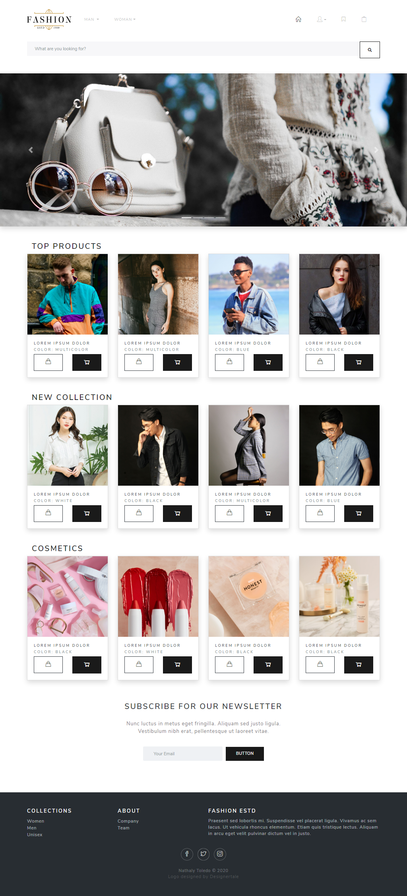

# Ecommerce Site Template

Static website that can be used as a template for an ecommerce site.

## Web pages
- Home
- Checkout
- Products list
- Product Details
- User Profile

## Tech

- [Bootstrap 5] - a free and open-source CSS framework.
- [HTML5] - a markup language used for structuring and presenting content.
- [CSS3] -  a style sheet language used for describing the presentation of a document.
- [JavaScript] - programming language that conforms to the ECMAScript specification.

## Demo

The website was hosted on [ecommerce-site.bss.design/](https://ecommerce-site.bss.design/).

[//]: # (These are reference links used in the body of this note and get stripped out when the markdown processor does its job.)
   [Bootstrap 5]: <https://getbootstrap.com/>
   [HTML5]: <https://html.com/>
   [CSS3]: <https://cssreference.io/>
   [JavaScript]: <https://www.javascript.com/>

